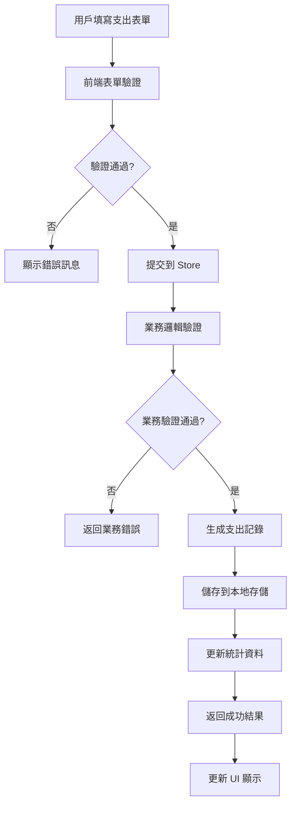
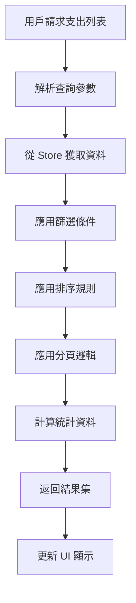

# 基礎功能完善設計文檔 - 資料架構和業務邏輯設計 (v2)

## 1. 設計概述

### 1.1 設計目標
建立穩固的資料架構和清晰的業務邏輯層，確保支出管理系統與現有收入系統的無縫整合，提供可擴展和可維護的資料解決方案。

### 1.2 設計原則
- **一致性**：與現有收入系統保持資料結構和操作模式的一致性
- **完整性**：確保資料的完整性和一致性約束
- **擴展性**：為未來功能擴展預留空間
- **效能性**：優化資料存取和計算效能

## 2. 資料架構設計

### 2.1 支出管理資料模型

#### 2.1.1 支出記錄 (Expense) 資料結構
```javascript
const ExpenseSchema = {
  id: {
    type: Number,
    required: true,
    unique: true,
    description: '唯一識別碼，使用時間戳記生成'
  },
  categoryId: {
    type: Number,
    required: true,
    description: '支出類別ID，外鍵關聯 ExpenseCategory'
  },
  amount: {
    type: Number,
    required: true,
    min: 0.01,
    description: '支出金額，必須為正數，精確到分'
  },
  date: {
    type: String,
    required: true,
    format: 'YYYY-MM-DD',
    description: '支出日期，ISO 日期格式'
  },
  description: {
    type: String,
    maxLength: 500,
    description: '支出說明，可選欄位'
  },
  vendor: {
    type: String,
    maxLength: 100,
    description: '廠商或收款人名稱'
  },
  receipt: {
    type: String,
    maxLength: 50,
    description: '收據或發票編號'
  },
  attachments: {
    type: Array,
    items: {
      type: Object,
      properties: {
        id: String,
        name: String,
        type: String, // 'image' | 'pdf' | 'document'
        url: String,
        size: Number
      }
    },
    description: '附件列表，支援多個檔案'
  },
  createdAt: {
    type: String,
    required: true,
    format: 'ISO 8601',
    description: '建立時間'
  },
  updatedAt: {
    type: String,
    required: true,
    format: 'ISO 8601',
    description: '最後更新時間'
  },
  createdBy: {
    type: String,
    description: '建立者ID，預留欄位'
  },
  status: {
    type: String,
    enum: ['active', 'deleted'],
    default: 'active',
    description: '記錄狀態，支援軟刪除'
  }
}
```

#### 2.1.2 支出類別 (ExpenseCategory) 資料結構
```javascript
const ExpenseCategorySchema = {
  id: {
    type: Number,
    required: true,
    unique: true,
    description: '類別唯一識別碼'
  },
  name: {
    type: String,
    required: true,
    maxLength: 50,
    description: '類別名稱'
  },
  color: {
    type: String,
    required: true,
    pattern: '^#[0-9A-Fa-f]{6}$',
    description: '顯示顏色，十六進位格式'
  },
  description: {
    type: String,
    maxLength: 200,
    description: '類別描述'
  },
  isDefault: {
    type: Boolean,
    default: false,
    description: '是否為系統預設類別'
  },
  isActive: {
    type: Boolean,
    default: true,
    description: '是否啟用'
  },
  sortOrder: {
    type: Number,
    default: 0,
    description: '排序順序'
  }
}
```

### 2.2 資料關聯設計

#### 2.2.1 實體關聯圖 (ERD)
```
ExpenseCategory (1) -----> (N) Expense
     │                        │
     │ id                     │ categoryId
     │ name                   │ amount
     │ color                  │ date
     │ description            │ description
     │ isDefault              │ vendor
     │ isActive               │ receipt
     │ sortOrder              │ attachments
                              │ createdAt
                              │ updatedAt
                              │ status
```

#### 2.2.2 資料完整性約束
- **外鍵約束**：Expense.categoryId 必須存在於 ExpenseCategory.id
- **檢查約束**：amount > 0, date 格式正確
- **唯一約束**：每個類別名稱在同一狀態下唯一
- **級聯規則**：刪除類別時檢查是否有關聯的支出記錄

### 2.3 資料存取層設計

#### 2.3.1 Pinia Store 架構
```javascript
// stores/expense.js
export const useExpenseStore = defineStore('expense', () => {
  // 狀態管理
  const expenses = ref([])
  const categories = ref([])
  const loading = ref(false)
  const error = ref(null)
  
  // 計算屬性
  const totalExpense = computed(() => {
    return expenses.value
      .filter(expense => expense.status === 'active')
      .reduce((sum, expense) => sum + expense.amount, 0)
  })
  
  const monthlyExpense = computed(() => {
    const currentMonth = dayjs().format('YYYY-MM')
    return expenses.value
      .filter(expense => 
        expense.status === 'active' && 
        dayjs(expense.date).format('YYYY-MM') === currentMonth
      )
      .reduce((sum, expense) => sum + expense.amount, 0)
  })
  
  const expenseByCategory = computed(() => {
    const result = {}
    categories.value.forEach(category => {
      result[category.name] = expenses.value
        .filter(expense => 
          expense.status === 'active' && 
          expense.categoryId === category.id
        )
        .reduce((sum, expense) => sum + expense.amount, 0)
    })
    return result
  })
  
  // 業務方法
  const addExpense = async (expenseData) => {
    // 實現新增邏輯
  }
  
  const updateExpense = async (id, expenseData) => {
    // 實現更新邏輯
  }
  
  const deleteExpense = async (id) => {
    // 實現軟刪除邏輯
  }
  
  return {
    expenses, categories, loading, error,
    totalExpense, monthlyExpense, expenseByCategory,
    addExpense, updateExpense, deleteExpense
  }
})
```

## 3. 業務邏輯設計

### 3.1 支出管理業務流程

#### 3.1.1 新增支出流程


#### 3.1.2 支出查詢流程


### 3.2 資料驗證邏輯

#### 3.2.1 前端驗證規則
```javascript
const expenseValidationRules = {
  categoryId: [
    { required: true, message: '請選擇支出類別', trigger: 'change' }
  ],
  amount: [
    { required: true, message: '請輸入支出金額', trigger: 'blur' },
    { type: 'number', min: 0.01, message: '金額必須大於0', trigger: 'blur' }
  ],
  date: [
    { required: true, message: '請選擇支出日期', trigger: 'change' },
    { 
      validator: (rule, value, callback) => {
        if (dayjs(value).isAfter(dayjs())) {
          callback(new Error('支出日期不能是未來日期'))
        } else {
          callback()
        }
      }, 
      trigger: 'change' 
    }
  ],
  vendor: [
    { max: 100, message: '廠商名稱不能超過100個字元', trigger: 'blur' }
  ],
  description: [
    { max: 500, message: '說明不能超過500個字元', trigger: 'blur' }
  ]
}
```

#### 3.2.2 業務邏輯驗證
```javascript
const validateExpenseData = (expenseData) => {
  const errors = []
  
  // 檢查類別是否存在且啟用
  const category = categories.value.find(c => c.id === expenseData.categoryId)
  if (!category || !category.isActive) {
    errors.push('選擇的支出類別無效或已停用')
  }
  
  // 檢查金額合理性
  if (expenseData.amount > 1000000) {
    errors.push('單筆支出金額過大，請確認')
  }
  
  // 檢查重複記錄
  const duplicate = expenses.value.find(e => 
    e.categoryId === expenseData.categoryId &&
    e.amount === expenseData.amount &&
    e.date === expenseData.date &&
    e.vendor === expenseData.vendor &&
    e.status === 'active'
  )
  if (duplicate) {
    errors.push('可能存在重複的支出記錄')
  }
  
  return errors
}
```

### 3.3 統計計算邏輯

#### 3.3.1 財務統計算法
```javascript
const calculateFinancialStats = (expenses, incomes, dateRange) => {
  const filteredExpenses = filterByDateRange(expenses, dateRange)
  const filteredIncomes = filterByDateRange(incomes, dateRange)
  
  return {
    totalExpense: filteredExpenses.reduce((sum, e) => sum + e.amount, 0),
    totalIncome: filteredIncomes.reduce((sum, i) => sum + i.amount, 0),
    netIncome: filteredIncomes.reduce((sum, i) => sum + i.amount, 0) - 
               filteredExpenses.reduce((sum, e) => sum + e.amount, 0),
    expenseByCategory: groupByCategory(filteredExpenses),
    incomeByCategory: groupByCategory(filteredIncomes),
    monthlyTrend: calculateMonthlyTrend(filteredExpenses, filteredIncomes)
  }
}
```

## 4. 資料同步和一致性

### 4.1 本地存儲策略
```javascript
const STORAGE_KEYS = {
  EXPENSES: 'temple-expenses',
  EXPENSE_CATEGORIES: 'temple-expense-categories',
  LAST_SYNC: 'temple-last-sync'
}

const saveToLocalStorage = async (key, data) => {
  try {
    const serialized = JSON.stringify(data)
    localStorage.setItem(key, serialized)
    localStorage.setItem(STORAGE_KEYS.LAST_SYNC, new Date().toISOString())
  } catch (error) {
    console.error('儲存失敗:', error)
    throw new Error('資料儲存失敗')
  }
}
```

### 4.2 資料一致性保證
- **原子性操作**：相關資料的更新作為一個事務處理
- **樂觀鎖定**：使用版本號或時間戳記防止併發衝突
- **資料校驗**：定期檢查資料完整性
- **錯誤恢復**：提供資料恢復和修復機制

## 5. 效能優化設計

### 5.1 資料載入優化
- **懶載入**：按需載入大量資料
- **分頁載入**：避免一次載入過多記錄
- **快取策略**：快取常用查詢結果
- **索引優化**：為常用查詢欄位建立索引

### 5.2 計算優化
- **增量計算**：只重新計算變更的部分
- **記憶化**：快取計算結果
- **背景計算**：將複雜計算移到背景執行
- **批次處理**：批次處理多個操作

## 6. 安全性設計

### 6.1 資料保護
- **輸入清理**：清理和驗證所有用戶輸入
- **SQL 注入防護**：使用參數化查詢
- **XSS 防護**：轉義輸出內容
- **檔案上傳安全**：限制檔案類型和大小

### 6.2 存取控制
- **權限驗證**：檢查用戶操作權限
- **資料隔離**：確保用戶只能存取自己的資料
- **操作日誌**：記錄所有重要操作
- **敏感資料加密**：加密儲存敏感資訊

## 7. 測試策略

### 7.1 單元測試
- **資料模型測試**：驗證資料結構和約束
- **業務邏輯測試**：測試計算和驗證邏輯
- **Store 測試**：測試狀態管理邏輯
- **工具函數測試**：測試輔助函數

### 7.2 整合測試
- **資料流測試**：測試組件間資料傳遞
- **API 整合測試**：測試前後端整合
- **儲存測試**：測試資料持久化
- **效能測試**：測試大量資料處理

## 8. 設計驗收標準

### 8.1 功能驗收
- [ ] 支出 CRUD 操作正確實現
- [ ] 資料驗證邏輯完整
- [ ] 統計計算準確
- [ ] 資料一致性維護良好

### 8.2 效能驗收
- [ ] 查詢響應時間 < 1 秒
- [ ] 支援 10,000+ 記錄
- [ ] 記憶體使用合理
- [ ] 無記憶體洩漏

### 8.3 安全驗收
- [ ] 輸入驗證完整
- [ ] 無安全漏洞
- [ ] 資料保護到位
- [ ] 錯誤處理安全
