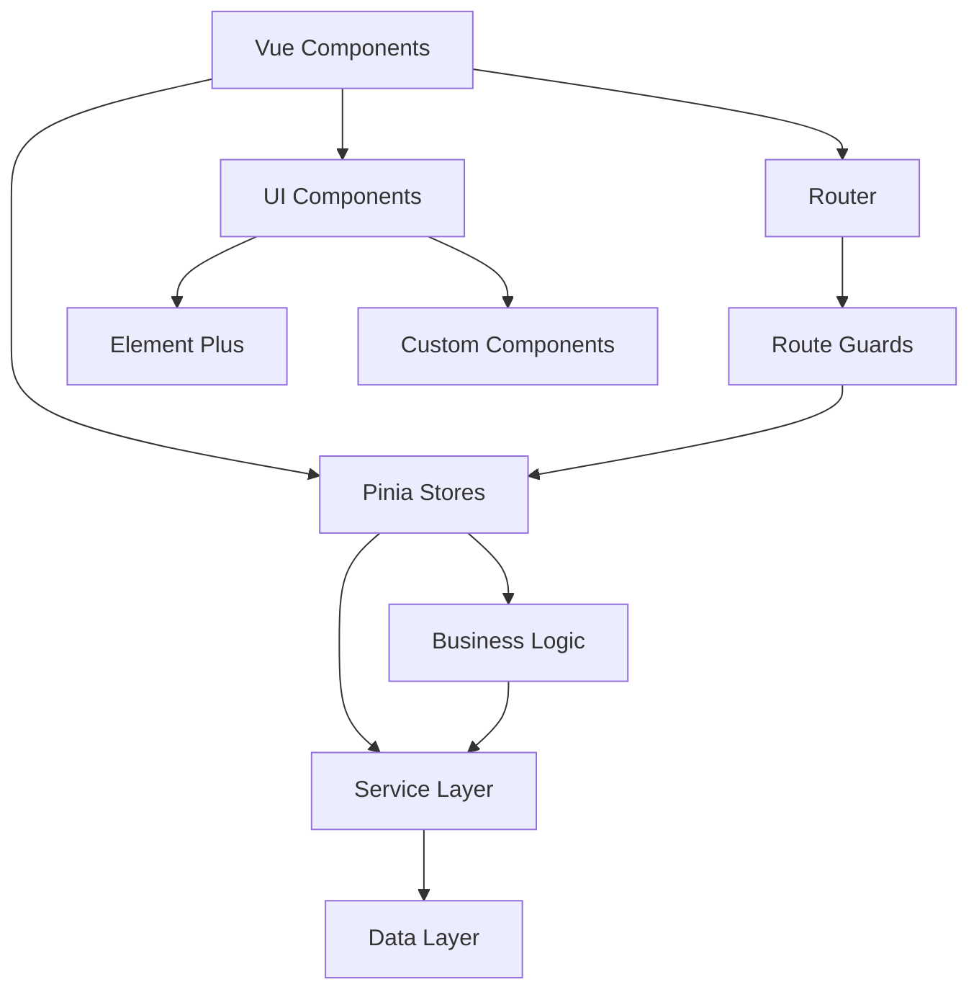

# 基礎功能完善設計文檔 - 系統整合和技術架構設計 (v3)

## 1. 設計概述

### 1.1 設計目標
建立穩固的技術架構基礎，確保新增功能與現有系統的無縫整合，提供可擴展、可維護、高效能的技術解決方案。

### 1.2 設計原則
- **模組化**：清晰的模組邊界和職責分離
- **可擴展性**：為未來功能擴展預留架構空間
- **可維護性**：代碼結構清晰，易於理解和修改
- **效能優先**：優化關鍵路徑的效能表現

## 2. 系統架構設計

### 2.1 整體架構圖
```
┌─────────────────────────────────────────────────────────┐
│                    Presentation Layer                   │
├─────────────────────────────────────────────────────────┤
│  Vue Components  │  Router  │  UI Components Library    │
│  IncomeAdd.vue   │  Routes  │  Element Plus + Custom    │
│  ExpenseList.vue │  Guards  │  Shared Components        │
│  Balance.vue     │  Meta    │  Layout Components        │
└─────────────────────────────────────────────────────────┘
                              │
┌─────────────────────────────────────────────────────────┐
│                   Application Layer                     │
├─────────────────────────────────────────────────────────┤
│  State Management │  Business Logic  │  Service Layer   │
│  Pinia Stores     │  Validators      │  API Services    │
│  Income Store     │  Calculators     │  File Services   │
│  Expense Store    │  Formatters      │  Storage Service │
│  App Store        │  Utils           │  Sync Service    │
└─────────────────────────────────────────────────────────┘
                              │
┌─────────────────────────────────────────────────────────┐
│                     Data Layer                         │
├─────────────────────────────────────────────────────────┤
│  Local Storage    │  File System     │  Future: Cloud   │
│  JSON Data        │  Attachments     │  Database API    │
│  User Preferences │  Exports         │  Sync API        │
│  Cache            │  Backups         │  Auth API        │
└─────────────────────────────────────────────────────────┘
```

### 2.2 模組依賴關係


## 3. 技術架構設計

### 3.1 前端架構

#### 3.1.1 組件架構
```
src/
├── components/           # 共用組件
│   ├── common/          # 通用組件
│   │   ├── FormCard.vue
│   │   ├── DataTable.vue
│   │   └── FileUpload.vue
│   ├── business/        # 業務組件
│   │   ├── CategorySelector.vue
│   │   ├── AmountInput.vue
│   │   └── StatsSummary.vue
│   └── layout/          # 布局組件
│       ├── PageHeader.vue
│       └── PageFooter.vue
├── views/               # 頁面組件
│   ├── income/
│   │   ├── IncomeList.vue
│   │   ├── IncomeAdd.vue
│   │   └── IncomeCategories.vue
│   ├── expense/
│   │   ├── ExpenseList.vue
│   │   ├── ExpenseAdd.vue
│   │   └── ExpenseCategories.vue
│   └── ...
├── stores/              # 狀態管理
│   ├── income.js
│   ├── expense.js
│   └── app.js
├── services/            # 服務層
│   ├── api.js
│   ├── storage.js
│   └── file.js
├── utils/               # 工具函數
│   ├── validators.js
│   ├── formatters.js
│   └── calculators.js
└── composables/         # 組合式函數
    ├── useForm.js
    ├── useTable.js
    └── useStats.js
```

#### 3.1.2 狀態管理架構
```javascript
// 統一的 Store 結構
const createStoreTemplate = (entityName) => ({
  // 狀態
  state: {
    items: ref([]),
    categories: ref([]),
    loading: ref(false),
    error: ref(null),
    filters: ref({}),
    pagination: ref({ page: 1, size: 20, total: 0 })
  },
  
  // 計算屬性
  getters: {
    totalAmount: computed(() => /* 計算邏輯 */),
    monthlyAmount: computed(() => /* 計算邏輯 */),
    filteredItems: computed(() => /* 篩選邏輯 */),
    statistics: computed(() => /* 統計邏輯 */)
  },
  
  // 操作方法
  actions: {
    async loadItems() { /* 載入邏輯 */ },
    async addItem(data) { /* 新增邏輯 */ },
    async updateItem(id, data) { /* 更新邏輯 */ },
    async deleteItem(id) { /* 刪除邏輯 */ },
    setFilters(filters) { /* 篩選邏輯 */ },
    setPagination(pagination) { /* 分頁邏輯 */ }
  }
})
```

### 3.2 服務層設計

#### 3.2.1 API 服務抽象
```javascript
// services/api.js
class ApiService {
  constructor(baseURL) {
    this.baseURL = baseURL
    this.interceptors = []
  }
  
  async request(method, url, data = null, options = {}) {
    // 統一的請求處理邏輯
    try {
      const response = await this.executeRequest(method, url, data, options)
      return this.handleResponse(response)
    } catch (error) {
      return this.handleError(error)
    }
  }
  
  // CRUD 操作的標準介面
  async get(url, params = {}) { return this.request('GET', url, null, { params }) }
  async post(url, data) { return this.request('POST', url, data) }
  async put(url, data) { return this.request('PUT', url, data) }
  async delete(url) { return this.request('DELETE', url) }
}

// 具體的業務 API
export const incomeApi = new ApiService('/api/income')
export const expenseApi = new ApiService('/api/expense')
```

#### 3.2.2 本地存儲服務
```javascript
// services/storage.js
class StorageService {
  constructor(prefix = 'temple-') {
    this.prefix = prefix
  }
  
  async save(key, data) {
    try {
      const serialized = JSON.stringify({
        data,
        timestamp: Date.now(),
        version: '1.0'
      })
      localStorage.setItem(this.prefix + key, serialized)
      return true
    } catch (error) {
      console.error('Storage save failed:', error)
      throw new Error('資料儲存失敗')
    }
  }
  
  async load(key) {
    try {
      const item = localStorage.getItem(this.prefix + key)
      if (!item) return null
      
      const parsed = JSON.parse(item)
      return parsed.data
    } catch (error) {
      console.error('Storage load failed:', error)
      return null
    }
  }
  
  async remove(key) {
    localStorage.removeItem(this.prefix + key)
  }
  
  async clear() {
    const keys = Object.keys(localStorage)
    keys.forEach(key => {
      if (key.startsWith(this.prefix)) {
        localStorage.removeItem(key)
      }
    })
  }
}

export const storage = new StorageService()
```

### 3.3 錯誤處理架構

#### 3.3.1 統一錯誤處理
```javascript
// utils/errorHandler.js
class ErrorHandler {
  static handle(error, context = '') {
    const errorInfo = {
      message: error.message,
      stack: error.stack,
      context,
      timestamp: new Date().toISOString(),
      userAgent: navigator.userAgent,
      url: window.location.href
    }
    
    // 記錄錯誤
    this.logError(errorInfo)
    
    // 顯示用戶友好的錯誤訊息
    this.showUserError(error)
    
    // 上報錯誤 (未來功能)
    this.reportError(errorInfo)
  }
  
  static logError(errorInfo) {
    console.error('Application Error:', errorInfo)
    // 儲存到本地日誌
    const logs = JSON.parse(localStorage.getItem('error-logs') || '[]')
    logs.push(errorInfo)
    // 保留最近 100 條錯誤記錄
    if (logs.length > 100) logs.shift()
    localStorage.setItem('error-logs', JSON.stringify(logs))
  }
  
  static showUserError(error) {
    const userMessage = this.getUserFriendlyMessage(error)
    ElMessage.error(userMessage)
  }
  
  static getUserFriendlyMessage(error) {
    const errorMap = {
      'NetworkError': '網路連線異常，請檢查網路設定',
      'ValidationError': '資料格式不正確，請檢查輸入內容',
      'StorageError': '資料儲存失敗，請檢查儲存空間',
      'PermissionError': '權限不足，無法執行此操作'
    }
    
    return errorMap[error.name] || '系統發生未知錯誤，請稍後再試'
  }
}

// 全域錯誤處理
window.addEventListener('error', (event) => {
  ErrorHandler.handle(event.error, 'Global Error')
})

window.addEventListener('unhandledrejection', (event) => {
  ErrorHandler.handle(event.reason, 'Unhandled Promise Rejection')
})
```

### 3.4 效能優化架構

#### 3.4.1 組件懶載入
```javascript
// router/index.js
const routes = [
  {
    path: '/income/add',
    name: 'IncomeAdd',
    component: () => import('../views/income/IncomeAdd.vue'),
    meta: { title: '新增收入' }
  },
  {
    path: '/expense/list',
    name: 'ExpenseList',
    component: () => import('../views/expense/ExpenseList.vue'),
    meta: { title: '支出記錄' }
  }
  // ... 其他路由
]
```

#### 3.4.2 資料快取策略
```javascript
// utils/cache.js
class CacheManager {
  constructor() {
    this.cache = new Map()
    this.ttl = new Map() // Time To Live
  }
  
  set(key, value, ttlMs = 300000) { // 預設 5 分鐘
    this.cache.set(key, value)
    this.ttl.set(key, Date.now() + ttlMs)
  }
  
  get(key) {
    if (this.isExpired(key)) {
      this.delete(key)
      return null
    }
    return this.cache.get(key)
  }
  
  isExpired(key) {
    const expireTime = this.ttl.get(key)
    return expireTime && Date.now() > expireTime
  }
  
  delete(key) {
    this.cache.delete(key)
    this.ttl.delete(key)
  }
  
  clear() {
    this.cache.clear()
    this.ttl.clear()
  }
}

export const cache = new CacheManager()
```

## 4. 整合設計

### 4.1 組件整合策略

#### 4.1.1 共用組件設計
```javascript
// components/common/DataTable.vue
<template>
  <div class="data-table">
    <el-table
      :data="paginatedData"
      :loading="loading"
      @sort-change="handleSort"
    >
      <slot name="columns"></slot>
    </el-table>
    
    <el-pagination
      v-model:current-page="currentPage"
      v-model:page-size="pageSize"
      :total="total"
      @size-change="handleSizeChange"
      @current-change="handleCurrentChange"
    />
  </div>
</template>

<script setup>
// 通用表格邏輯
const props = defineProps({
  data: Array,
  loading: Boolean,
  pagination: Object
})

const emit = defineEmits(['sort-change', 'page-change'])

// 分頁邏輯
const paginatedData = computed(() => {
  const start = (currentPage.value - 1) * pageSize.value
  return props.data.slice(start, start + pageSize.value)
})
</script>
```

#### 4.1.2 業務組件整合
```javascript
// composables/useFinancialData.js
export function useFinancialData() {
  const incomeStore = useIncomeStore()
  const expenseStore = useExpenseStore()
  
  const totalBalance = computed(() => {
    return incomeStore.totalIncome - expenseStore.totalExpense
  })
  
  const monthlyBalance = computed(() => {
    return incomeStore.monthlyIncome - expenseStore.monthlyExpense
  })
  
  const financialSummary = computed(() => ({
    income: {
      total: incomeStore.totalIncome,
      monthly: incomeStore.monthlyIncome,
      byCategory: incomeStore.incomeByCategory
    },
    expense: {
      total: expenseStore.totalExpense,
      monthly: expenseStore.monthlyExpense,
      byCategory: expenseStore.expenseByCategory
    },
    balance: {
      total: totalBalance.value,
      monthly: monthlyBalance.value
    }
  }))
  
  return {
    totalBalance,
    monthlyBalance,
    financialSummary
  }
}
```

### 4.2 資料同步設計

#### 4.2.1 跨 Store 資料同步
```javascript
// stores/sync.js
export const useSyncStore = defineStore('sync', () => {
  const lastSyncTime = ref(null)
  const syncStatus = ref('idle') // 'idle', 'syncing', 'error'
  
  const syncAllData = async () => {
    syncStatus.value = 'syncing'
    try {
      // 同步收入資料
      await incomeStore.sync()
      // 同步支出資料
      await expenseStore.sync()
      // 更新同步時間
      lastSyncTime.value = new Date().toISOString()
      syncStatus.value = 'idle'
    } catch (error) {
      syncStatus.value = 'error'
      throw error
    }
  }
  
  return {
    lastSyncTime,
    syncStatus,
    syncAllData
  }
})
```

## 5. 測試架構

### 5.1 測試策略
```javascript
// tests/unit/stores/expense.test.js
import { describe, it, expect, beforeEach } from 'vitest'
import { setActivePinia, createPinia } from 'pinia'
import { useExpenseStore } from '@/stores/expense'

describe('Expense Store', () => {
  beforeEach(() => {
    setActivePinia(createPinia())
  })
  
  it('should add expense correctly', async () => {
    const store = useExpenseStore()
    const expenseData = {
      categoryId: 1,
      amount: 1000,
      date: '2024-01-01',
      description: 'Test expense'
    }
    
    await store.addExpense(expenseData)
    
    expect(store.expenses).toHaveLength(1)
    expect(store.totalExpense).toBe(1000)
  })
})
```

### 5.2 E2E 測試架構
```javascript
// tests/e2e/expense-management.spec.js
import { test, expect } from '@playwright/test'

test('should create new expense', async ({ page }) => {
  await page.goto('/expense/add')
  
  // 填寫表單
  await page.selectOption('[data-testid="category-select"]', '1')
  await page.fill('[data-testid="amount-input"]', '1000')
  await page.fill('[data-testid="date-input"]', '2024-01-01')
  
  // 提交表單
  await page.click('[data-testid="submit-button"]')
  
  // 驗證結果
  await expect(page.locator('.success-message')).toBeVisible()
})
```

## 6. 部署和維護

### 6.1 建置配置
```javascript
// vite.config.js
export default defineConfig({
  plugins: [vue()],
  build: {
    rollupOptions: {
      output: {
        manualChunks: {
          vendor: ['vue', 'vue-router', 'pinia'],
          ui: ['element-plus'],
          charts: ['echarts'],
          utils: ['dayjs', 'xlsx']
        }
      }
    }
  },
  optimizeDeps: {
    include: ['vue', 'vue-router', 'pinia', 'element-plus']
  }
})
```

### 6.2 監控和日誌
```javascript
// utils/monitor.js
class PerformanceMonitor {
  static trackPageLoad(pageName) {
    const startTime = performance.now()
    
    return () => {
      const loadTime = performance.now() - startTime
      console.log(`Page ${pageName} loaded in ${loadTime}ms`)
      
      // 記錄效能資料
      this.recordMetric('page_load_time', loadTime, { page: pageName })
    }
  }
  
  static recordMetric(name, value, tags = {}) {
    const metric = {
      name,
      value,
      tags,
      timestamp: Date.now()
    }
    
    // 儲存到本地或上報到監控系統
    const metrics = JSON.parse(localStorage.getItem('performance-metrics') || '[]')
    metrics.push(metric)
    localStorage.setItem('performance-metrics', JSON.stringify(metrics))
  }
}
```

## 7. 設計驗收標準

### 7.1 架構驗收
- [ ] 模組邊界清晰，職責分離良好
- [ ] 組件復用性高，耦合度低
- [ ] 錯誤處理機制完善
- [ ] 效能優化措施到位

### 7.2 整合驗收
- [ ] 新舊功能整合無縫
- [ ] 資料同步機制穩定
- [ ] 跨組件通信正常
- [ ] 第三方庫整合良好

### 7.3 維護驗收
- [ ] 代碼結構清晰易懂
- [ ] 測試覆蓋率充足
- [ ] 文檔完整準確
- [ ] 監控機制有效
