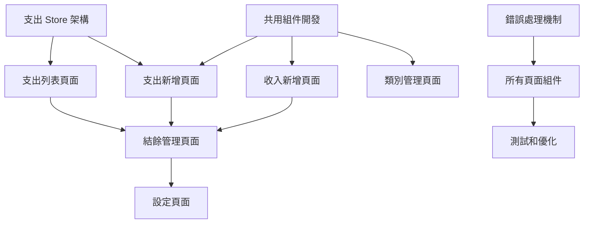

# 基礎功能完善任務計劃 (最終版)

## 1. 任務概述

### 1.1 目標
完成階段 1 基礎功能完善的所有開發任務，包括 UI 組件開發、資料層實現、系統整合，確保功能完整性和系統穩定性。

### 1.2 範圍
- 收入管理 UI 組件開發
- 支出管理系統完整實現
- 其他核心頁面組件開發
- 共用組件和服務層開發
- 資料層和業務邏輯實現
- 基礎測試和錯誤處理
- 系統整合和優化

## 2. 核心任務分解

### 2.1 基礎架構任務 (第 1 週)

#### 任務 1.1：共用組件開發
**優先級：** 高 | **預估時間：** 12 小時 | **負責人：** 前端開發者

**子任務：**
- [ ] 1.1.1 FormCard 組件開發 (2h)
  - 表單卡片容器組件
  - 統一的樣式和布局
  - 標題和描述支援

- [ ] 1.1.2 DataTable 組件開發 (4h)
  - 通用表格組件
  - 排序、篩選、分頁功能
  - 自訂欄位支援

- [ ] 1.1.3 CategorySelector 組件開發 (2h)
  - 類別選擇器組件
  - 顏色顯示和搜尋功能
  - 收入/支出類別通用

- [ ] 1.1.4 AmountInput 組件開發 (2h)
  - 金額輸入組件
  - 千分位格式化
  - 數字驗證

- [ ] 1.1.5 FileUpload 組件開發 (2h)
  - 檔案上傳組件
  - 拖拽上傳支援
  - 進度顯示

#### 任務 1.2：支出 Store 基礎架構
**優先級：** 高 | **預估時間：** 8 小時 | **負責人：** 前端開發者

**子任務：**
- [ ] 1.2.1 創建 expense.js Store (2h)
  - 基本 Pinia Store 結構
  - 狀態變數定義
  - 預設類別初始化

- [ ] 1.2.2 實現基本計算屬性 (2h)
  - totalExpense 總支出計算
  - monthlyExpense 月支出計算
  - expenseByCategory 分類統計

- [ ] 1.2.3 實現 CRUD 操作 (4h)
  - addExpense 新增支出
  - updateExpense 更新支出
  - deleteExpense 刪除支出
  - 本地存儲整合

#### 任務 1.3：錯誤處理機制
**優先級：** 中 | **預估時間：** 4 小時 | **負責人：** 前端開發者

**子任務：**
- [ ] 1.3.1 建立錯誤處理工具 (2h)
  - 創建 utils/errorHandler.js
  - 統一錯誤處理邏輯
  - 用戶友好訊息轉換

- [ ] 1.3.2 全域錯誤攔截 (2h)
  - Vue 錯誤處理器設置
  - Promise 錯誤攔截
  - 錯誤日誌記錄

### 2.2 收入管理 UI 完善 (第 1-2 週)

#### 任務 2.1：收入新增頁面開發
**優先級：** 高 | **預估時間：** 8 小時 | **負責人：** 前端開發者

**子任務：**
- [ ] 2.1.1 創建 IncomeAdd.vue 組件 (2h)
  - 頁面基本結構
  - 路由和導航設置
  - 頁面標題和麵包屑

- [ ] 2.1.2 實現收入新增表單 (4h)
  - 類別選擇（使用 CategorySelector）
  - 金額輸入（使用 AmountInput）
  - 日期、捐款人、說明欄位

- [ ] 2.1.3 表單驗證和提交 (2h)
  - 即時表單驗證
  - 提交邏輯整合
  - 成功/失敗訊息處理

#### 任務 2.2：收入類別管理頁面
**優先級：** 中 | **預估時間：** 6 小時 | **負責人：** 前端開發者

**子任務：**
- [ ] 2.2.1 創建 IncomeCategories.vue 組件 (2h)
  - 頁面結構和類別列表
  - 新增類別按鈕

- [ ] 2.2.2 實現類別管理功能 (3h)
  - 類別 CRUD 操作
  - 顏色選擇器
  - 拖拽排序功能

- [ ] 2.2.3 類別使用檢查 (1h)
  - 刪除前檢查關聯記錄
  - 警告訊息顯示

### 2.3 支出管理系統開發 (第 2-3 週)

#### 任務 3.1：支出記錄列表頁面
**優先級：** 高 | **預估時間：** 10 小時 | **負責人：** 前端開發者

**子任務：**
- [ ] 3.1.1 創建 ExpenseList.vue 組件 (2h)
  - 複用 IncomeList 設計模式
  - 支出特有欄位調整

- [ ] 3.1.2 實現工具列功能 (3h)
  - 日期範圍篩選
  - 類別篩選
  - 關鍵字搜尋

- [ ] 3.1.3 實現統計摘要 (2h)
  - 支出統計計算
  - 即時數據更新

- [ ] 3.1.4 實現資料表格 (3h)
  - 支出記錄顯示
  - 編輯/刪除操作
  - 分頁控制

#### 任務 3.2：支出新增頁面開發
**優先級：** 高 | **預估時間：** 10 小時 | **負責人：** 前端開發者

**子任務：**
- [ ] 3.2.1 創建 ExpenseAdd.vue 組件 (2h)
  - 基於 IncomeAdd 設計
  - 支出特有欄位調整

- [ ] 3.2.2 實現支出表單 (4h)
  - 支出類別選擇
  - 廠商/收款人輸入
  - 收據編號欄位

- [ ] 3.2.3 實現附件上傳 (3h)
  - 使用 FileUpload 組件
  - 圖片預覽功能
  - 檔案格式限制

- [ ] 3.2.4 表單驗證整合 (1h)
  - 支出特有驗證規則
  - 錯誤處理整合

#### 任務 3.3：支出類別管理
**優先級：** 中 | **預估時間：** 4 小時 | **負責人：** 前端開發者

**子任務：**
- [ ] 3.3.1 創建 ExpenseCategories.vue (2h)
  - 複用收入類別管理設計
  - 預設支出類別設置

- [ ] 3.3.2 實現支出類別管理 (2h)
  - 類別 CRUD 操作
  - 與支出記錄關聯檢查

### 2.4 其他核心頁面 (第 3-4 週)

#### 任務 4.1：結餘管理頁面
**優先級：** 中 | **預估時間：** 8 小時 | **負責人：** 前端開發者

**子任務：**
- [ ] 4.1.1 創建 Balance.vue 組件 (2h)
  - 頁面結構和結餘概覽
  - 收支統計整合

- [ ] 4.1.2 實現結餘計算 (3h)
  - 期初/期末結餘計算
  - 收支數據整合
  - 即時更新機制

- [ ] 4.1.3 實現結餘調整功能 (3h)
  - 調整金額輸入
  - 調整原因記錄
  - 調整歷史查看

#### 任務 4.2：個人設定頁面
**優先級：** 低 | **預估時間：** 6 小時 | **負責人：** 前端開發者

**子任務：**
- [ ] 4.2.1 創建 Profile.vue 組件 (2h)
  - 基本資訊設定區域
  - 偏好設定區域

- [ ] 4.2.2 實現基本資訊管理 (2h)
  - 姓名、職位、郵件設定
  - 資料驗證和儲存

- [ ] 4.2.3 實現偏好設定 (2h)
  - 日期格式、貨幣格式
  - 顯示偏好設定

#### 任務 4.3：系統設定頁面
**優先級：** 低 | **預估時間：** 6 小時 | **負責人：** 前端開發者

**子任務：**
- [ ] 4.3.1 創建 Settings.vue 組件 (2h)
  - 系統設定分類
  - 基本布局設計

- [ ] 4.3.2 實現備份設定 (2h)
  - 自動備份配置
  - 手動備份功能

- [ ] 4.3.3 實現系統維護 (2h)
  - 資料清理工具
  - 系統資訊顯示

### 2.5 測試和優化 (第 4 週)

#### 任務 5.1：基礎測試
**優先級：** 中 | **預估時間：** 8 小時 | **負責人：** 前端開發者

**子任務：**
- [ ] 5.1.1 設置測試環境 (2h)
  - Vitest 配置
  - 測試工具安裝

- [ ] 5.1.2 Store 單元測試 (3h)
  - income.js 測試
  - expense.js 測試

- [ ] 5.1.3 組件測試 (3h)
  - 共用組件測試
  - 核心頁面組件測試

#### 任務 5.2：效能優化
**優先級：** 低 | **預估時間：** 4 小時 | **負責人：** 前端開發者

**子任務：**
- [ ] 5.2.1 載入效能優化 (2h)
  - 代碼分割實現
  - 資源壓縮優化

- [ ] 5.2.2 運行時優化 (2h)
  - 計算結果快取
  - 渲染效能優化

## 3. 任務依賴關係

## 4. 里程碑

### 里程碑 1：基礎架構完成 (第 1 週結束)
- [ ] 共用組件開發完成
- [ ] 支出 Store 基礎架構完成
- [ ] 錯誤處理機制建立
- [ ] 收入新增頁面完成

### 里程碑 2：核心功能完成 (第 2 週結束)
- [ ] 收入類別管理完成
- [ ] 支出新增頁面完成
- [ ] 支出列表頁面完成

### 里程碑 3：管理功能完成 (第 3 週結束)
- [ ] 支出類別管理完成
- [ ] 結餘管理頁面完成
- [ ] 基礎測試完成

### 里程碑 4：完善和優化 (第 4 週結束)
- [ ] 個人設定頁面完成
- [ ] 系統設定頁面完成
- [ ] 效能優化完成
- [ ] 所有功能測試通過

## 5. 資源分配

### 5.1 人力資源
- **前端開發者 1 名**：主要負責 UI 組件和頁面開發
- **全端開發者 1 名**：負責 Store、業務邏輯和系統整合
- **測試人員 0.5 名**：負責測試用例編寫和執行

### 5.2 時間分配
- **總預估時間**：約 100 小時
- **開發週期**：4 週
- **每週工作量**：約 25 小時

## 6. 風險管理

### 6.1 技術風險
- **風險**：Element Plus 組件客製化困難
- **緩解**：提前技術驗證，準備替代方案
- **負責人**：前端開發者

### 6.2 時程風險
- **風險**：任務依賴導致開發延遲
- **緩解**：並行開發獨立任務，關鍵路徑監控
- **負責人**：專案經理

### 6.3 品質風險
- **風險**：功能整合問題
- **緩解**：分階段整合測試，定期代碼審查
- **負責人**：全端開發者

## 7. 驗收標準

### 7.1 功能驗收
- [ ] 所有路由頁面正常運作
- [ ] 收入和支出 CRUD 功能完整
- [ ] 資料統計計算準確
- [ ] 錯誤處理機制完善

### 7.2 品質驗收
- [ ] 代碼通過 ESLint 檢查
- [ ] 測試覆蓋率 > 70%
- [ ] 無明顯效能問題
- [ ] 跨瀏覽器相容性良好

### 7.3 用戶體驗驗收
- [ ] 界面設計一致性良好
- [ ] 操作流程直觀順暢
- [ ] 響應式設計正常
- [ ] 錯誤訊息友好清晰
