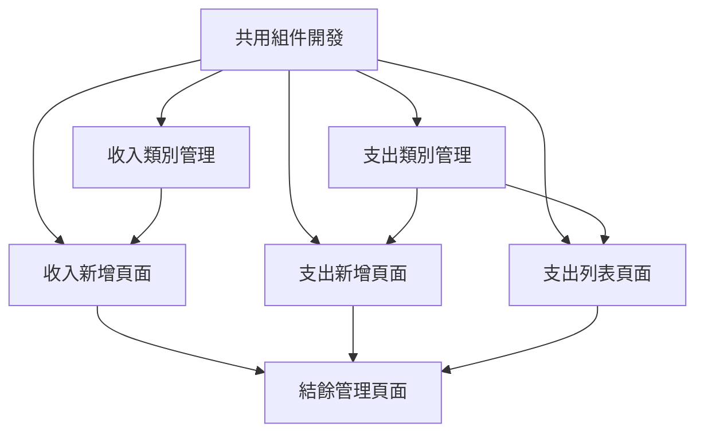

# 基礎功能完善任務計劃 (最終版)

## 1. 任務概述

### 1.1 目標
完成階段 1 基礎功能完善的所有開發任務，包括 UI 組件開發、資料層實現、系統整合，確保功能完整性和系統穩定性。

### 1.2 範圍
- 收入管理 UI 組件開發
- 支出管理系統完整實現
- 其他核心頁面組件開發
- 共用組件和服務層開發
- 資料層和業務邏輯實現
- 基礎測試和錯誤處理
- 系統整合和優化

## 2. 任務分解

### 2.1 收入管理 UI 組件開發

#### 任務 1.1：收入新增頁面開發
**優先級：** 高
**預估時間：** 8 小時
**負責人：** 前端開發者

**子任務：**
- [ ] 1.1.1 創建 IncomeAdd.vue 組件結構 (2h)
  - 建立基本頁面框架
  - 設置路由和導航
  - 添加頁面標題和麵包屑

- [ ] 1.1.2 實現收入新增表單 (4h)
  - 類別選擇下拉選單（含顏色顯示）
  - 金額輸入框（數字驗證、千分位格式）
  - 日期選擇器（預設今日）
  - 捐款人輸入框
  - 說明多行文字輸入

- [ ] 1.1.3 表單驗證和提交邏輯 (2h)
  - 即時表單驗證
  - 提交按鈕狀態管理
  - 成功/失敗訊息顯示
  - 表單重置功能

**驗收標準：**
- 表單布局符合設計規範
- 所有驗證規則正常運作
- 提交流程順暢無誤
- 響應式設計在各設備正常

#### 任務 1.2：收入類別管理頁面開發
**優先級：** 中
**預估時間：** 6 小時
**負責人：** 前端開發者

**子任務：**
- [ ] 1.2.1 創建 IncomeCategories.vue 組件 (2h)
  - 頁面基本結構
  - 類別列表表格
  - 新增類別按鈕

- [ ] 1.2.2 實現類別管理功能 (3h)
  - 類別列表顯示（顏色、名稱、描述）
  - 新增類別對話框
  - 編輯類別功能
  - 刪除類別確認

- [ ] 1.2.3 拖拽排序功能 (1h)
  - 實現類別拖拽排序
  - 排序狀態保存
  - 視覺反饋效果

### 2.2 支出管理 UI 組件開發

#### 任務 2.1：支出記錄列表頁面開發
**優先級：** 高
**預估時間：** 10 小時
**負責人：** 前端開發者

**子任務：**
- [ ] 2.1.1 創建 ExpenseList.vue 組件結構 (2h)
  - 複用 IncomeList 的設計模式
  - 調整支出特有的欄位顯示
  - 設置頁面標題和導航

- [ ] 2.1.2 實現工具列功能 (3h)
  - 日期範圍篩選器
  - 類別篩選下拉選單
  - 關鍵字搜尋框
  - 新增支出按鈕

- [ ] 2.1.3 實現統計摘要區域 (2h)
  - 記錄筆數統計
  - 總金額計算
  - 平均金額顯示
  - 最大金額顯示

- [ ] 2.1.4 實現資料表格 (3h)
  - 支出記錄列表顯示
  - 排序功能
  - 編輯/刪除操作
  - 分頁控制

**驗收標準：**
- 列表功能與收入列表保持一致
- 篩選和搜尋功能正常
- 統計數據準確
- 操作流程順暢

#### 任務 2.2：支出新增頁面開發
**優先級：** 高
**預估時間：** 10 小時
**負責人：** 前端開發者

**子任務：**
- [ ] 2.2.1 創建 ExpenseAdd.vue 組件 (2h)
  - 基於 IncomeAdd 的設計模式
  - 調整支出特有欄位
  - 頁面結構和導航

- [ ] 2.2.2 實現支出表單 (4h)
  - 支出類別選擇
  - 金額輸入（支出為正數）
  - 日期選擇
  - 廠商/收款人輸入
  - 收據編號輸入

- [ ] 2.2.3 實現附件上傳功能 (3h)
  - 檔案上傳組件
  - 圖片預覽功能
  - PDF 檔案支援
  - 檔案大小和格式限制

- [ ] 2.2.4 表單驗證和提交 (1h)
  - 支出特有的驗證規則
  - 提交邏輯整合
  - 錯誤處理

#### 任務 2.3：支出類別管理頁面開發
**優先級：** 中
**預估時間：** 4 小時
**負責人：** 前端開發者

**子任務：**
- [ ] 2.3.1 創建 ExpenseCategories.vue 組件 (2h)
  - 複用收入類別管理的設計
  - 調整預設類別內容
  - 頁面結構適配

- [ ] 2.3.2 實現支出類別管理 (2h)
  - 預設類別初始化
  - 類別 CRUD 操作
  - 與支出記錄的關聯檢查

### 2.3 其他核心頁面開發

#### 任務 3.1：結餘管理頁面開發
**優先級：** 中
**預估時間：** 8 小時
**負責人：** 前端開發者

**子任務：**
- [ ] 3.1.1 創建 Balance.vue 組件 (2h)
  - 頁面基本結構
  - 結餘概覽區域
  - 調整功能區域

- [ ] 3.1.2 實現結餘顯示功能 (3h)
  - 期初結餘顯示
  - 本期收入/支出統計
  - 期末結餘計算
  - 數據即時更新

- [ ] 3.1.3 實現結餘調整功能 (3h)
  - 調整金額輸入
  - 調整原因說明
  - 調整記錄保存
  - 調整歷史查看

#### 任務 3.2：個人設定頁面開發
**優先級：** 低
**預估時間：** 6 小時
**負責人：** 前端開發者

**子任務：**
- [ ] 3.2.1 創建 Profile.vue 組件 (2h)
  - 頁面基本結構
  - 設定分類區域
  - 表單布局

- [ ] 3.2.2 實現基本資訊設定 (2h)
  - 姓名、職位、郵件輸入
  - 資料驗證
  - 儲存功能

- [ ] 3.2.3 實現偏好設定 (2h)
  - 日期格式選擇
  - 貨幣顯示格式
  - 每頁顯示筆數
  - 設定保存和載入

#### 任務 3.3：系統設定頁面開發
**優先級：** 低
**預估時間：** 6 小時
**負責人：** 前端開發者

**子任務：**
- [ ] 3.3.1 創建 Settings.vue 組件 (2h)
  - 頁面結構設計
  - 設定分類導航
  - 基本布局

- [ ] 3.3.2 實現備份設定功能 (2h)
  - 自動備份開關
  - 備份頻率設定
  - 手動備份按鈕
  - 備份檔案管理

- [ ] 3.3.3 實現系統維護功能 (2h)
  - 資料清理工具
  - 快取清除功能
  - 系統資訊顯示
  - 重置選項

### 2.4 共用組件開發

#### 任務 4.1：共用組件開發
**優先級：** 中
**預估時間：** 12 小時
**負責人：** 前端開發者

**子任務：**
- [ ] 4.1.1 FormCard 組件開發 (2h)
  - 表單卡片容器
  - 標題和描述顯示
  - 統一的樣式

- [ ] 4.1.2 DataTable 組件開發 (4h)
  - 通用表格組件
  - 排序、篩選、分頁
  - 自訂欄位支援

- [ ] 4.1.3 CategorySelector 組件開發 (2h)
  - 類別選擇器
  - 顏色顯示
  - 搜尋功能

- [ ] 4.1.4 AmountInput 組件開發 (2h)
  - 金額輸入組件
  - 千分位格式化
  - 數字驗證

- [ ] 4.1.5 FileUpload 組件開發 (2h)
  - 檔案上傳組件
  - 拖拽上傳
  - 進度顯示

## 3. 任務依賴關係

## 4. 里程碑

### 里程碑 1：核心組件完成 (第 1-2 週)
- [ ] 共用組件開發完成
- [ ] 收入新增頁面完成
- [ ] 支出新增頁面完成

### 里程碑 2：管理功能完成 (第 3 週)
- [ ] 收入類別管理完成
- [ ] 支出類別管理完成
- [ ] 支出列表頁面完成

### 里程碑 3：輔助功能完成 (第 4 週)
- [ ] 結餘管理頁面完成
- [ ] 個人設定頁面完成
- [ ] 系統設定頁面完成

## 5. 風險和緩解措施

### 5.1 技術風險
- **風險**：Element Plus 組件客製化困難
- **緩解**：提前進行技術驗證，準備替代方案

### 5.2 時程風險
- **風險**：UI 設計調整導致開發延遲
- **緩解**：優先完成核心功能，次要功能可後續迭代

### 5.3 品質風險
- **風險**：不同頁面間的一致性問題
- **緩解**：建立設計檢查清單，定期進行 UI 審查
