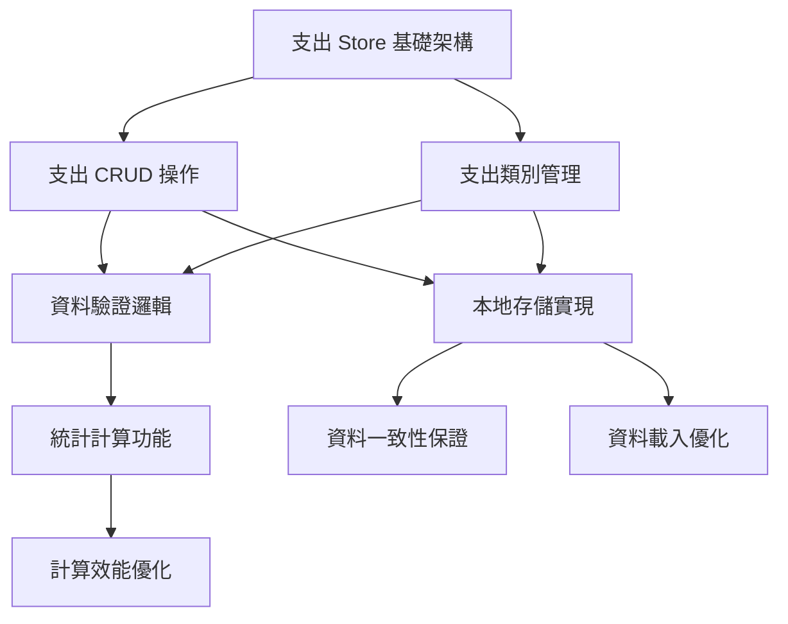

# 基礎功能完善任務計劃 - 資料層和業務邏輯視角 (v2)

## 1. 任務概述

### 1.1 目標
建立完整的支出管理資料層和業務邏輯，確保與現有收入系統的無縫整合，提供穩定可靠的資料服務。

### 1.2 範圍
- 支出管理 Store 開發
- 業務邏輯實現
- 資料驗證和處理
- 統計計算功能
- 資料同步和一致性

## 2. 任務分解

### 2.1 支出管理 Store 開發

#### 任務 1.1：支出 Store 基礎架構
**優先級：** 高
**預估時間：** 6 小時
**負責人：** 前端開發者

**子任務：**
- [ ] 1.1.1 創建 expense.js Store 檔案 (1h)
  - 建立基本 Pinia Store 結構
  - 定義狀態變數
  - 設置基本配置

- [ ] 1.1.2 實現支出資料狀態管理 (2h)
  - expenses 陣列狀態
  - loading 狀態管理
  - error 錯誤狀態
  - filters 篩選狀態

- [ ] 1.1.3 實現支出類別狀態管理 (2h)
  - categories 陣列狀態
  - 預設類別初始化
  - 類別排序狀態
  - 類別啟用狀態

- [ ] 1.1.4 建立計算屬性 (1h)
  - totalExpense 總支出計算
  - monthlyExpense 月支出計算
  - expenseByCategory 分類統計
  - recentExpenses 最近記錄

**驗收標準：**
- Store 結構與 income.js 保持一致
- 所有狀態正確初始化
- 計算屬性響應式更新
- 無記憶體洩漏問題

#### 任務 1.2：支出 CRUD 操作實現
**優先級：** 高
**預估時間：** 8 小時
**負責人：** 前端開發者

**子任務：**
- [ ] 1.2.1 實現新增支出功能 (2h)
  - addExpense 方法實現
  - 資料驗證邏輯
  - ID 生成機制
  - 時間戳記處理

- [ ] 1.2.2 實現更新支出功能 (2h)
  - updateExpense 方法實現
  - 部分更新支援
  - 更新時間記錄
  - 狀態同步處理

- [ ] 1.2.3 實現刪除支出功能 (2h)
  - deleteExpense 方法實現
  - 軟刪除機制
  - 刪除確認邏輯
  - 關聯資料處理

- [ ] 1.2.4 實現查詢支出功能 (2h)
  - getExpenseById 方法
  - getExpensesByDateRange 方法
  - 篩選和排序邏輯
  - 分頁查詢支援

#### 任務 1.3：支出類別管理實現
**優先級：** 中
**預估時間：** 6 小時
**負責人：** 前端開發者

**子任務：**
- [ ] 1.3.1 實現類別 CRUD 操作 (3h)
  - addCategory 新增類別
  - updateCategory 更新類別
  - deleteCategory 刪除類別
  - 類別使用檢查邏輯

- [ ] 1.3.2 實現預設類別初始化 (2h)
  - 預設類別資料定義
  - 初始化邏輯
  - 類別顏色分配
  - 排序順序設定

- [ ] 1.3.3 實現類別排序功能 (1h)
  - 拖拽排序支援
  - 排序狀態保存
  - 排序邏輯實現

### 2.2 業務邏輯實現

#### 任務 2.1：資料驗證邏輯
**優先級：** 高
**預估時間：** 6 小時
**負責人：** 前端開發者

**子任務：**
- [ ] 2.1.1 建立驗證工具函數 (2h)
  - validators.js 檔案創建
  - 基本驗證函數實現
  - 錯誤訊息定義
  - 驗證規則配置

- [ ] 2.1.2 實現支出資料驗證 (2h)
  - 金額驗證（正數、範圍）
  - 日期驗證（格式、範圍）
  - 類別驗證（存在性、啟用狀態）
  - 文字欄位驗證（長度、格式）

- [ ] 2.1.3 實現業務邏輯驗證 (2h)
  - 重複記錄檢查
  - 金額合理性檢查
  - 日期邏輯檢查
  - 關聯資料驗證

**驗收標準：**
- 所有驗證規則正確實現
- 錯誤訊息清晰易懂
- 驗證效能良好
- 邊界條件處理完善

#### 任務 2.2：統計計算功能
**優先級：** 中
**預估時間：** 8 小時
**負責人：** 前端開發者

**子任務：**
- [ ] 2.2.1 建立計算工具函數 (2h)
  - calculators.js 檔案創建
  - 基礎統計函數
  - 日期範圍處理
  - 分組聚合邏輯

- [ ] 2.2.2 實現支出統計計算 (3h)
  - 總支出計算
  - 分類支出統計
  - 時間範圍統計
  - 平均值、最大值計算

- [ ] 2.2.3 實現收支整合計算 (3h)
  - 淨收入計算
  - 收支對比分析
  - 結餘變化計算
  - 趨勢分析邏輯

#### 任務 2.3：資料格式化功能
**優先級：** 低
**預估時間：** 4 小時
**負責人：** 前端開發者

**子任務：**
- [ ] 2.3.1 建立格式化工具函數 (2h)
  - formatters.js 檔案創建
  - 貨幣格式化函數
  - 日期格式化函數
  - 數字格式化函數

- [ ] 2.3.2 實現專用格式化邏輯 (2h)
  - 支出金額顯示格式
  - 類別顯示格式
  - 統計數據格式
  - 匯出資料格式

### 2.3 資料持久化和同步

#### 任務 3.1：本地存儲實現
**優先級：** 高
**預估時間：** 6 小時
**負責人：** 前端開發者

**子任務：**
- [ ] 3.1.1 實現支出資料存儲 (2h)
  - saveExpenses 方法實現
  - loadExpenses 方法實現
  - 資料序列化處理
  - 錯誤處理機制

- [ ] 3.1.2 實現類別資料存儲 (2h)
  - saveCategories 方法實現
  - loadCategories 方法實現
  - 預設類別處理
  - 版本相容性處理

- [ ] 3.1.3 實現資料備份機制 (2h)
  - 自動備份邏輯
  - 備份檔案管理
  - 資料恢復功能
  - 備份驗證機制

#### 任務 3.2：資料一致性保證
**優先級：** 中
**預估時間：** 4 小時
**負責人：** 前端開發者

**子任務：**
- [ ] 3.2.1 實現事務處理機制 (2h)
  - 原子性操作保證
  - 回滾機制實現
  - 併發控制邏輯
  - 資料鎖定機制

- [ ] 3.2.2 實現資料校驗功能 (2h)
  - 資料完整性檢查
  - 關聯資料驗證
  - 異常資料修復
  - 定期校驗機制

### 2.4 效能優化

#### 任務 4.1：計算效能優化
**優先級：** 中
**預估時間：** 6 小時
**負責人：** 前端開發者

**子任務：**
- [ ] 4.1.1 實現計算快取機制 (3h)
  - 計算結果快取
  - 快取失效邏輯
  - 記憶化實現
  - 快取策略優化

- [ ] 4.1.2 實現增量計算 (3h)
  - 增量更新邏輯
  - 變更檢測機制
  - 部分重新計算
  - 計算依賴管理

#### 任務 4.2：資料載入優化
**優先級：** 低
**預估時間：** 4 小時
**負責人：** 前端開發者

**子任務：**
- [ ] 4.2.1 實現懶載入機制 (2h)
  - 按需載入邏輯
  - 載入狀態管理
  - 預載入策略
  - 載入優先級

- [ ] 4.2.2 實現分頁載入 (2h)
  - 分頁查詢邏輯
  - 虛擬滾動支援
  - 載入更多功能
  - 記憶體管理

## 3. 任務依賴關係

## 4. 里程碑

### 里程碑 1：核心資料層完成 (第 1 週)
- [ ] 支出 Store 基礎架構完成
- [ ] 支出 CRUD 操作完成
- [ ] 基本資料驗證完成

### 里程碑 2：業務邏輯完成 (第 2 週)
- [ ] 支出類別管理完成
- [ ] 統計計算功能完成
- [ ] 本地存儲實現完成

### 里程碑 3：優化和完善 (第 3 週)
- [ ] 資料一致性保證完成
- [ ] 效能優化完成
- [ ] 資料格式化功能完成

## 5. 測試策略

### 5.1 單元測試
- Store 方法測試
- 計算邏輯測試
- 驗證函數測試
- 工具函數測試

### 5.2 整合測試
- Store 間資料同步測試
- 資料持久化測試
- 效能基準測試
- 錯誤處理測試

## 6. 風險和緩解措施

### 6.1 資料風險
- **風險**：資料遺失或損壞
- **緩解**：實現多重備份機制，定期資料校驗

### 6.2 效能風險
- **風險**：大量資料導致效能問題
- **緩解**：實現分頁載入和計算優化

### 6.3 一致性風險
- **風險**：收支資料不一致
- **緩解**：建立統一的資料管理機制
