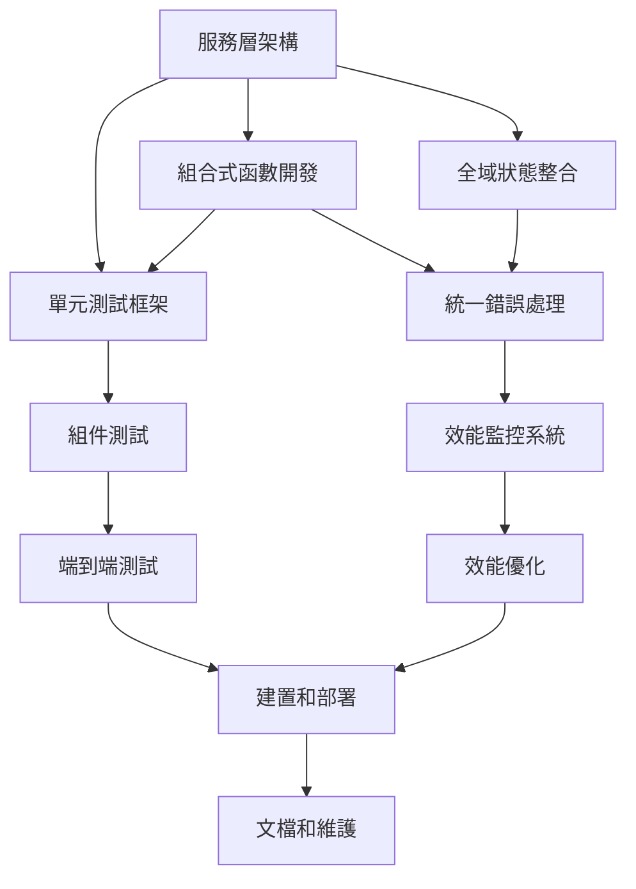

# 基礎功能完善任務計劃 - 系統整合和測試視角 (v3)

## 1. 任務概述

### 1.1 目標
確保所有新增功能與現有系統的完美整合，建立完整的測試體系，保證系統的穩定性和可靠性。

### 1.2 範圍
- 系統架構整合
- 組件間通信
- 錯誤處理機制
- 測試體系建立
- 效能監控和優化
- 部署和維護

## 2. 任務分解

### 2.1 系統架構整合

#### 任務 1.1：服務層架構建立
**優先級：** 高
**預估時間：** 8 小時
**負責人：** 全端開發者

**子任務：**
- [ ] 1.1.1 建立統一 API 服務層 (3h)
  - 創建 services/api.js
  - 實現統一請求處理
  - 建立錯誤攔截機制
  - 設置請求/響應轉換

- [ ] 1.1.2 實現本地存儲服務 (2h)
  - 創建 services/storage.js
  - 統一存儲介面設計
  - 資料序列化處理
  - 存儲錯誤處理

- [ ] 1.1.3 建立檔案處理服務 (2h)
  - 創建 services/file.js
  - 檔案上傳處理
  - 圖片壓縮功能
  - 檔案格式驗證

- [ ] 1.1.4 實現同步服務架構 (1h)
  - 創建 services/sync.js
  - 為未來雲端同步預留介面
  - 離線狀態管理
  - 同步衝突處理框架

**驗收標準：**
- 服務層介面統一清晰
- 錯誤處理機制完善
- 為未來擴展預留空間
- 代碼結構清晰可維護

#### 任務 1.2：組合式函數開發
**優先級：** 中
**預估時間：** 6 小時
**負責人：** 前端開發者

**子任務：**
- [ ] 1.2.1 建立表單處理組合函數 (2h)
  - 創建 composables/useForm.js
  - 統一表單驗證邏輯
  - 表單狀態管理
  - 提交處理邏輯

- [ ] 1.2.2 建立表格處理組合函數 (2h)
  - 創建 composables/useTable.js
  - 分頁邏輯封裝
  - 排序和篩選邏輯
  - 選擇狀態管理

- [ ] 1.2.3 建立統計數據組合函數 (2h)
  - 創建 composables/useStats.js
  - 財務統計邏輯
  - 圖表資料處理
  - 即時計算邏輯

#### 任務 1.3：全域狀態整合
**優先級：** 高
**預估時間：** 4 小時
**負責人：** 前端開發者

**子任務：**
- [ ] 1.3.1 完善 App Store 功能 (2h)
  - 擴展 stores/app.js
  - 全域設定管理
  - 用戶偏好設定
  - 系統狀態管理

- [ ] 1.3.2 實現跨 Store 資料同步 (2h)
  - Store 間通信機制
  - 資料一致性保證
  - 狀態變更通知
  - 依賴關係管理

### 2.2 錯誤處理和監控

#### 任務 2.1：統一錯誤處理機制
**優先級：** 高
**預估時間：** 6 小時
**負責人：** 全端開發者

**子任務：**
- [ ] 2.1.1 建立錯誤處理類 (2h)
  - 創建 utils/errorHandler.js
  - 錯誤分類和處理
  - 用戶友好訊息轉換
  - 錯誤日誌記錄

- [ ] 2.1.2 實現全域錯誤攔截 (2h)
  - Vue 錯誤處理器設置
  - Promise 錯誤攔截
  - 網路錯誤處理
  - 未處理錯誤捕獲

- [ ] 2.1.3 建立錯誤恢復機制 (2h)
  - 自動重試邏輯
  - 降級處理策略
  - 用戶操作引導
  - 錯誤狀態清除

#### 任務 2.2：效能監控系統
**優先級：** 中
**預估時間：** 6 小時
**負責人：** 全端開發者

**子任務：**
- [ ] 2.2.1 建立效能監控工具 (3h)
  - 創建 utils/monitor.js
  - 頁面載入時間監控
  - 操作響應時間監控
  - 記憶體使用監控

- [ ] 2.2.2 實現效能資料收集 (2h)
  - 關鍵指標定義
  - 資料收集邏輯
  - 本地資料存儲
  - 資料上報機制

- [ ] 2.2.3 建立效能警告機制 (1h)
  - 效能閾值設定
  - 警告觸發邏輯
  - 用戶提示機制
  - 自動優化建議

### 2.3 測試體系建立

#### 任務 3.1：單元測試框架
**優先級：** 高
**預估時間：** 10 小時
**負責人：** 全端開發者

**子任務：**
- [ ] 3.1.1 設置測試環境 (2h)
  - Vitest 配置設置
  - 測試工具安裝
  - 測試環境配置
  - 模擬資料準備

- [ ] 3.1.2 Store 單元測試 (4h)
  - income.js 測試用例
  - expense.js 測試用例
  - app.js 測試用例
  - 狀態變更測試

- [ ] 3.1.3 工具函數測試 (2h)
  - validators.js 測試
  - formatters.js 測試
  - calculators.js 測試
  - 邊界條件測試

- [ ] 3.1.4 組合函數測試 (2h)
  - useForm.js 測試
  - useTable.js 測試
  - useStats.js 測試
  - 整合測試

#### 任務 3.2：組件測試
**優先級：** 中
**預估時間：** 8 小時
**負責人：** 前端開發者

**子任務：**
- [ ] 3.2.1 共用組件測試 (4h)
  - FormCard 組件測試
  - DataTable 組件測試
  - CategorySelector 組件測試
  - AmountInput 組件測試

- [ ] 3.2.2 頁面組件測試 (4h)
  - IncomeAdd 組件測試
  - ExpenseAdd 組件測試
  - ExpenseList 組件測試
  - Balance 組件測試

#### 任務 3.3：端到端測試
**優先級：** 中
**預估時間：** 12 小時
**負責人：** 全端開發者

**子任務：**
- [ ] 3.3.1 設置 E2E 測試環境 (2h)
  - Playwright 配置
  - 測試資料準備
  - 測試環境設置
  - CI/CD 整合

- [ ] 3.3.2 核心流程測試 (6h)
  - 收入管理流程測試
  - 支出管理流程測試
  - 類別管理流程測試
  - 統計查看流程測試

- [ ] 3.3.3 跨瀏覽器測試 (2h)
  - Chrome 測試
  - Firefox 測試
  - Safari 測試
  - Edge 測試

- [ ] 3.3.4 響應式設計測試 (2h)
  - 桌面版測試
  - 平板版測試
  - 手機版測試
  - 不同解析度測試

### 2.4 效能優化

#### 任務 4.1：載入效能優化
**優先級：** 中
**預估時間：** 6 小時
**負責人：** 前端開發者

**子任務：**
- [ ] 4.1.1 實現代碼分割 (2h)
  - 路由級別代碼分割
  - 組件級別懶載入
  - 第三方庫分割
  - 載入優先級設定

- [ ] 4.1.2 資源優化 (2h)
  - 圖片壓縮和優化
  - CSS 和 JS 壓縮
  - 字體檔案優化
  - 靜態資源快取

- [ ] 4.1.3 載入策略優化 (2h)
  - 關鍵資源優先載入
  - 預載入策略
  - 漸進式載入
  - 載入狀態優化

#### 任務 4.2：運行時效能優化
**優先級：** 低
**預估時間：** 4 小時
**負責人：** 前端開發者

**子任務：**
- [ ] 4.2.1 計算效能優化 (2h)
  - 計算結果快取
  - 防抖和節流
  - 虛擬滾動實現
  - 大量資料處理優化

- [ ] 4.2.2 渲染效能優化 (2h)
  - 組件更新優化
  - 不必要渲染避免
  - 記憶體洩漏防止
  - DOM 操作優化

### 2.5 部署和維護

#### 任務 5.1：建置和部署
**優先級：** 中
**預估時間：** 4 小時
**負責人：** 全端開發者

**子任務：**
- [ ] 5.1.1 優化建置配置 (2h)
  - Vite 配置優化
  - 建置產物分析
  - 壓縮和混淆設定
  - 環境變數管理

- [ ] 5.1.2 Electron 打包配置 (2h)
  - 打包配置優化
  - 安裝包大小優化
  - 自動更新機制
  - 多平台支援

#### 任務 5.2：文檔和維護
**優先級：** 低
**預估時間：** 6 小時
**負責人：** 全端開發者

**子任務：**
- [ ] 5.2.1 技術文檔編寫 (3h)
  - API 文檔
  - 組件使用文檔
  - 部署指南
  - 故障排除指南

- [ ] 5.2.2 維護工具開發 (3h)
  - 日誌分析工具
  - 效能監控面板
  - 資料備份工具
  - 系統健康檢查

## 3. 任務依賴關係

## 4. 里程碑

### 里程碑 1：基礎架構完成 (第 1 週)
- [ ] 服務層架構建立完成
- [ ] 組合式函數開發完成
- [ ] 統一錯誤處理機制完成

### 里程碑 2：測試體系完成 (第 2-3 週)
- [ ] 單元測試框架完成
- [ ] 組件測試完成
- [ ] 端到端測試完成

### 里程碑 3：優化和部署 (第 4 週)
- [ ] 效能優化完成
- [ ] 建置和部署配置完成
- [ ] 文檔和維護工具完成

## 5. 品質保證

### 5.1 代碼品質
- ESLint 規則配置
- Prettier 格式化
- TypeScript 類型檢查
- 代碼審查流程

### 5.2 測試覆蓋率
- 單元測試覆蓋率 > 80%
- 組件測試覆蓋率 > 70%
- E2E 測試覆蓋核心流程
- 效能測試基準建立

## 6. 風險和緩解措施

### 6.1 整合風險
- **風險**：新舊功能整合問題
- **緩解**：分階段整合，充分測試

### 6.2 效能風險
- **風險**：新功能影響整體效能
- **緩解**：建立效能基準，持續監控

### 6.3 相容性風險
- **風險**：跨平台相容性問題
- **緩解**：多平台測試，相容性檢查
